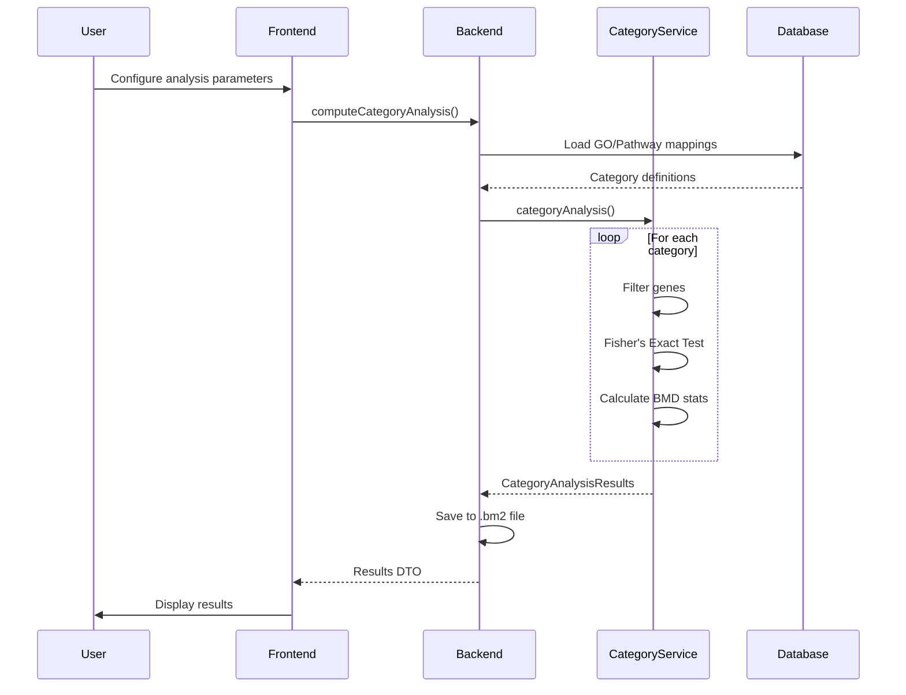

# Category Analysis Computation - Implementation Plan

## Overview

This document outlines the plan to implement category analysis computation capability in the BMDExpress web application, allowing users to run GO and Pathway analyses directly in the browser without the desktop application.

## Executive Summary

- **Effort Estimate:** 2-3 weeks for full implementation
- **Complexity:** Medium
- **Dependencies:** Already available via bmdexpress3 Maven dependency
- **Value:** High - enables full analysis workflow in web app

---

## 1. Core Components (Already Available)

### Backend Java Classes ✅
These are already included via the `bmdexpress3` dependency (pom.xml:56-61):

- `CategoryAnalysisService` - Main computation service
- `CategoryMapTool` - Core analysis logic with Fisher's Exact Test
- `GOTermMapBMDAnalysis` - Gene Ontology analysis
- `GenesPathwaysBMDAnalysis` - Pathway analysis (BioPlanet, REACTOME)
- `CategoryAnalysisParameters` - 40+ configurable parameters
- BMD statistics calculation (mean, median, min, SD, weighted stats)

### Data Files Needed (Must Download/Bundle)

From PathwayToGeneSymbolUtility.java line 78, databases are downloaded from:
```java
BMDExpressProperties.getInstance().getUpdateURL() + "/go/" + fName
```

**Required files:**
1. **Gene Ontology (GO) databases:**
   - `gotermlevel.gz` - GO term definitions and hierarchy
   - GO annotation files per species/platform
   - Biological Process (BP), Molecular Function (MF), Cellular Component (CC)

2. **Pathway databases:**
   - BioPlanet pathway-to-gene mappings
   - REACTOME pathway-to-gene mappings

3. **Gene-to-probe mappings:**
   - Platform-specific annotation files (Agilent, Affymetrix, etc.)

**Estimated size:** 50-100MB compressed

---

## 2. Implementation Strategy - Option A: Server-Side (Recommended)

### Advantages
- ✅ No browser memory/CPU limitations
- ✅ Can handle large datasets (10,000+ genes)
- ✅ Reuse existing BMDExpress3 code directly
- ✅ Can run long computations in background
- ✅ Results saved to .bm2 file automatically

### Architecture

```
Frontend (React/TypeScript)
    ↓
  Hilla RPC
    ↓
CategoryAnalysisComputationService (Java)
    ↓
CategoryAnalysisService (BMDExpress3)
    ↓
CategoryMapTool
    ↓
Results → Update BMDProject → Save .bm2
```

---

## 3. Implementation Phases

### Phase 1: MVP - Basic GO Analysis (1 week)

**Scope:**
- Single analysis type: GO Biological Process
- Essential parameters only:
  - Min # of Genes in Gene Set
  - Deduplicate Gene Sets
- Synchronous computation (blocks until done)
- No progress tracking

**Tasks:**
1. Create `CategoryAnalysisComputationService.java`
2. Bundle GO Biological Process database in resources
3. Create basic parameter form UI
4. Wire up computation endpoint
5. Display results in existing CategoryResultsView

**Deliverable:** Users can run basic GO BP analysis on existing BMD results

---

### Phase 2: Full GO & Pathway Support (1 week)

**Scope:**
- All 3 GO categories (BP, MF, CC)
- Pathway analysis (BioPlanet, REACTOME)
- Background computation with progress tracking
- Cancellation support

**Tasks:**
1. Bundle all GO and pathway databases
2. Implement background job system
3. Add progress tracking via Server-Sent Events
4. Create analysis type selector UI
5. Add computation status indicators

**Deliverable:** Full category analysis support with progress feedback

---

### Phase 3: Advanced Features (1 week)

**Scope:**
- Complete parameter UI (all 40+ options)
- IVIVE calculations (In Vitro to In Vivo Extrapolation)
- Parameter presets/templates
- Analysis history/versioning

**Tasks:**
1. Build comprehensive parameter configuration UI
2. Add IVIVE parameter support
3. Create parameter template system
4. Add analysis comparison features
5. Implement result export options

**Deliverable:** Feature parity with desktop application

---

## 4. Technical Implementation Details

### 4.1 Backend Service

**File:** `src/main/java/com/sciome/service/CategoryAnalysisComputationService.java`

```java
@Service
@BrowserCallable
@AnonymousAllowed
public class CategoryAnalysisComputationService {

    @Autowired
    private ProjectService projectService;

    @Autowired
    private CategoryAnalysisService categoryAnalysisService;

    /**
     * Compute category analysis on existing BMD results
     */
    public CategoryAnalysisResultsDto computeCategoryAnalysis(
            String projectId,
            String bmdResultName,
            CategoryAnalysisParametersDto params,
            CategoryAnalysisEnum analysisType) {

        // 1. Get project and BMD results
        BMDProject project = projectService.getProject(projectId);
        BMDResult bmdResult = findBmdResult(project, bmdResultName);

        // 2. Convert DTO to domain parameters
        CategoryAnalysisParameters domainParams = params.toDomain();

        // 3. Run analysis
        CategoryAnalysisResults results = categoryAnalysisService
            .categoryAnalysis(domainParams, bmdResult, analysisType, null);

        // 4. Save to project
        project.getCategoryAnalysisResults().add(results);
        projectService.saveProject(projectId, project);

        // 5. Return DTO
        return CategoryAnalysisResultsDto.fromDomain(results);
    }
}
```

### 4.2 Database Bundling

**Directory structure:**
```
src/main/resources/
  categorydata/
    go/
      gotermlevel.gz
      go_bp_annotations_rat.gz
      go_bp_annotations_mouse.gz
      go_bp_annotations_human.gz
      go_mf_annotations_rat.gz
      go_cc_annotations_rat.gz
    pathways/
      bioplanet_rat.txt
      bioplanet_mouse.txt
      reactome_rat.txt
      reactome_mouse.txt
    chips/
      agilent_rat_annotations.gz
      affymetrix_rat_annotations.gz
```

### 4.3 Progress Tracking (Phase 2)

**Backend:**
```java
public class AnalysisProgressTracker implements ICategoryMapToolProgress {
    private final SseEmitter emitter;

    @Override
    public void updateProgress(String message, double progress) {
        try {
            emitter.send(SseEmitter.event()
                .name("progress")
                .data(Map.of("message", message, "progress", progress)));
        } catch (IOException e) {
            // Handle error
        }
    }
}
```

**Frontend:**
```typescript
const eventSource = new EventSource(`/api/analysis/progress/${jobId}`);
eventSource.addEventListener('progress', (event) => {
    const data = JSON.parse(event.data);
    setProgress(data.progress);
    setMessage(data.message);
});
```

### 4.4 Parameter UI Component

**File:** `src/main/frontend/components/CategoryAnalysisForm.tsx`

```typescript
interface CategoryAnalysisFormProps {
    projectId: string;
    bmdResultName: string;
}

export function CategoryAnalysisForm({ projectId, bmdResultName }: CategoryAnalysisFormProps) {
    const [analysisType, setAnalysisType] = useState<'GO_BP' | 'GO_MF' | 'GO_CC' | 'PATHWAY'>('GO_BP');
    const [params, setParams] = useState<CategoryAnalysisParameters>({
        removeMinGenesInSet: false,
        minGenesInSet: 3,
        deduplicateGeneSets: true,
        // ... 40+ other parameters
    });

    // Form UI with validation
    // Submit handler calls CategoryAnalysisComputationService
}
```

---

## 5. Computation Flow



---

## 6. Key Parameters to Expose

### Essential (Phase 1)
1. **Min # of Genes in Gene Set** - Filter categories with too few genes
2. **Deduplicate Gene Sets** - Remove redundant categories

### Common (Phase 2)
3. **Analysis Type** - GO BP/MF/CC, BioPlanet, REACTOME
4. **Remove Promiscuous Probes** - Filter multi-mapping probes
5. **Remove BMD with p-Value < Cutoff** - Quality filter
6. **Remove BMD with R² < Cutoff** - Goodness of fit filter
7. **Max # of Genes in Gene Set** - Exclude overly broad categories

### Advanced (Phase 3)
8. **BMD/BMDL Ratio filters** - Confidence interval filtering
9. **Fold Change filters** - Effect size filtering
10. **Step Function removal** - Remove non-monotonic responses
11. **IVIVE parameters** - Dose extrapolation (10+ sub-parameters)
12. All 40+ parameters from CategoryAnalysisParameters

---

## 7. Challenges & Solutions

| Challenge | Solution | Priority |
|-----------|----------|----------|
| **Long computation time (minutes)** | Background jobs + SSE progress | High |
| **Large database files (50-100MB)** | gzip compression, lazy loading, server caching | High |
| **Memory usage with large datasets** | Stream processing, limit concurrent jobs | Medium |
| **File versioning (GO updates quarterly)** | Check update server, allow manual refresh | Low |
| **Multiple platform support** | Bundle top 5 platforms initially | Medium |
| **Concurrent analysis requests** | Job queue with max concurrency limit | Medium |

---

## 8. Testing Strategy

### Unit Tests
- Parameter validation
- DTO conversions
- Database loading

### Integration Tests
- Full analysis computation
- Progress tracking
- Result persistence

### Performance Tests
- Large dataset (10,000 genes)
- Multiple concurrent analyses
- Memory usage profiling

---

## 9. Success Criteria

### Phase 1 Complete When:
- [ ] User can run GO BP analysis via web UI
- [ ] Results display correctly in CategoryResultsView
- [ ] Results save to .bm2 file
- [ ] All tests passing

### Phase 2 Complete When:
- [ ] All GO categories available (BP, MF, CC)
- [ ] Pathway analysis available (BioPlanet, REACTOME)
- [ ] Progress bar shows real-time updates
- [ ] User can cancel running analysis

### Phase 3 Complete When:
- [ ] All 40+ parameters configurable
- [ ] IVIVE calculations working
- [ ] Parameter templates available
- [ ] Feature parity with desktop app

---

## 10. Alternative: Client-Side Computation (Not Recommended)

### Why Not Client-Side?
- ❌ Would require Java-to-JavaScript transpilation (GWT/J2CL)
- ❌ Browser memory limitations (typically 2-4GB)
- ❌ Single-threaded JavaScript execution
- ❌ Large database downloads to browser
- ❌ Poor performance on low-end devices
- ❌ Complex build pipeline

### When Client-Side Might Work:
- Small datasets (<1000 genes)
- Pre-computed category mappings
- WebAssembly compilation of core algorithms
- Service worker for background processing

**Recommendation:** Stick with server-side for production use

---

## 11. Resource Requirements

### Development
- Backend developer: 2-3 weeks
- Frontend developer: 1-2 weeks (UI work)
- Testing: 3-5 days

### Infrastructure
- Disk space: ~200MB for all databases
- RAM: ~500MB per concurrent analysis
- CPU: 1-2 cores per analysis (runs 30s - 5min)

### Dependencies
- ✅ bmdexpress3 JAR (already included)
- ✅ Spring Boot (already included)
- ✅ Hilla/Vaadin (already included)
- ➕ Category database files (need to bundle)

---

## 12. Next Steps

### Immediate (Week 1)
1. Download GO BP database files from BMDExpress update server
2. Create CategoryAnalysisComputationService skeleton
3. Create basic parameter form UI
4. Test computation with sample data

### Short-term (Weeks 2-3)
1. Implement progress tracking
2. Bundle all GO categories
3. Add pathway databases
4. Complete parameter UI

### Long-term (Month 2+)
1. IVIVE support
2. Analysis templates
3. Result comparison tools
4. Performance optimization

---

## 13. Documentation Needs

- [ ] User guide: How to run category analysis
- [ ] Parameter reference: What each parameter does
- [ ] Database update procedure
- [ ] API documentation for CategoryAnalysisComputationService
- [ ] Troubleshooting guide

---

## 14. Future Enhancements

- **Batch Analysis:** Run multiple parameter sets in parallel
- **Cloud Integration:** Offload computation to cloud functions
- **Custom Categories:** Allow user-defined gene sets
- **Result Comparison:** Side-by-side analysis comparison
- **Export Options:** Excel, CSV, PDF reports
- **Visualization:** Enhanced category analysis charts

---

## Appendix A: All 40+ Parameters

### Gene/Probe Filtering
1. removePromiscuousProbes (boolean)
2. removeBMDPValueLessCuttoff + pValueCutoff (double)
3. removeRSquared + rSquared (double)
4. removeBMDBMDLRatio + bmdBmdlRatio (double)
5. removeBMDUBMDLRatio + bmduBmdlRatio (double)
6. removeBMDUBMDRatio + bmduBmdRatio (double)
7. removeNFoldBelowLowestDose + nFoldbelowLowestDoseValue (double)
8. userFoldChangeFilter + maxFoldChange (double)
9. userPValueFilter + pValue (double)
10. userAdjustedPValueFilter + adjustedPValue (double)
11. identifyConflictingProbeSets + correlationCutoffConflictingProbeSets (double)
12. removeStepFunction (boolean)
13. removeStepFunctionWithBMDLower (boolean)
14. removeAdverseDirection + removeAdverseDirectionValue (string)
15. removeABSZscore + aBsZScore (double)
16. removeABSModelFC + aBsModelFC (double)

### Category Filtering
17. removeMinGenesInSet + minGenesInSet (int)
18. removeMaxGenesInSet + maxGenesInSet (int)
19. deduplicateGeneSets (boolean)

### Analysis Configuration
20. goCat (string) - GO category
21. goTermIdx (int) - GO term index
22. pathwayDB (string) - Pathway database name
23. probeFileParameters (DefinedCategoryFileParameters)
24. categoryFileParameters (DefinedCategoryFileParameters)

### IVIVE Parameters (10+ sub-parameters)
25. iviveParameters.species
26. iviveParameters.compound.MW
27. iviveParameters.compound.LogP
28. iviveParameters.compound.pKaDonors
29. iviveParameters.compound.pKaAcceptors
30. iviveParameters.compound.CLint
31. iviveParameters.compound.Fup
32. iviveParameters.doseSpacing
33. iviveParameters.finalTime
34. iviveParameters.quantile
35. iviveParameters.invivo (boolean)

---

## Appendix B: Database File Formats

### GO Annotation File Format
```
probe_id    gene_id    gene_symbol    GO:0008150    GO:0009987    ...
101234      1234       GENE1          1             0             ...
101235      1235       GENE2          0             1             ...
```

### Pathway File Format
```
pathway_id    pathway_name                  gene_symbols
PATH001       Cell cycle regulation         GENE1,GENE2,GENE3
PATH002       Apoptosis                     GENE4,GENE5,GENE6
```

---

## Appendix C: API Endpoint Specification

### Compute Category Analysis
```
POST /connect/CategoryAnalysisComputationService/computeCategoryAnalysis

Request:
{
  "projectId": "P3MP-Parham",
  "bmdResultName": "Chlorpyrifos_Male_Rat_CurveFitPrefilter",
  "analysisType": "GO_BP",
  "parameters": {
    "removeMinGenesInSet": true,
    "minGenesInSet": 3,
    "deduplicateGeneSets": true,
    ...
  }
}

Response:
{
  "name": "Chlorpyrifos_Male_Rat_GO_BP",
  "categoryResults": [...],
  "analysisInfo": {
    "notes": [...]
  }
}
```

### Get Analysis Progress
```
GET /api/analysis/progress/{jobId}
Server-Sent Events stream

Event: progress
Data: {"message": "Processing categories...", "progress": 0.45}
```

---

**Document Version:** 1.0
**Last Updated:** 2025-10-22
**Author:** Claude Code Analysis
